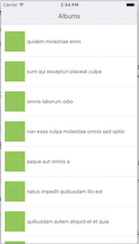
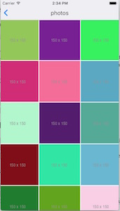

# galleryApp

### Description

A simple photo gallery app.

Application contains three screens:
1. Album list. 
2. Album photos list (shown when clicking on an album from the album list screen). 
3. Photo details screen, showing the photo and its details (shown when clicking on a photo from the photo list). 

### Technologies used

1. `react-native`
2. `react-redux`
3. `redux-saga`

### 3rd party packages

1. `react-native-grid-view`: Component allows to display a grid/collection of items with more than one item per row. Click [here](https://www.npmjs.com/package/react-native-grid-view) for more info.
2. `native-base`: is a free and open source UI component library for React Native. Click [here](https://docs.nativebase.io/#Introduction)

### Installation

1. `npm install`
2. `react-native link`
3. Run the project from xcode or run `react-native run-ios`

### Supported Platforms

1. iOS

